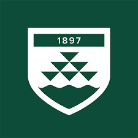
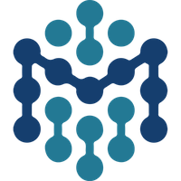
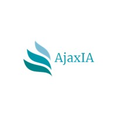
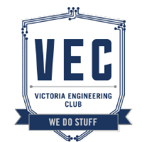
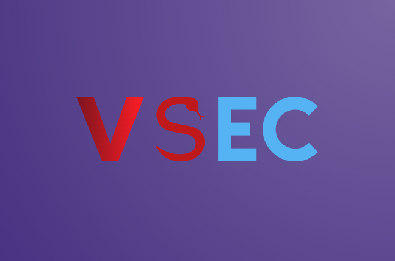
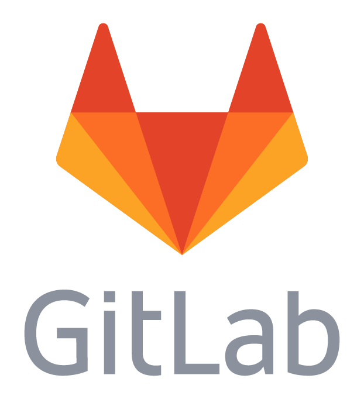

## Hey I'm Ben 

- I'm a **First Year Cyber Security** Engineering Hons Student 
- I Specialise in Digital Forensics, Incident Response and **Cyber Crime investigation**
- I **Lead groups** and projects with a passion for getting things done  
- Check out my [LinkedIn](https://www.linkedin.com/in/ben-vandw/) for more informtion about me , or [contact me](contact@greenbeanie.com)
- You can also [Veiw my Portfolio](https://www.greenbeanie.dev/)

## Organisations

  
  
  
  
  

## Platforms

  
  
  
  

## Languages

  
  
  

<!--

Here are some ideas to get you started:

- 🔭 I’m currently working on ...
- 🌱 I’m currently learning ...
- 👯 I’m looking to collaborate on ...
- 🤔 I’m looking for help with ...
- 💬 Ask me about ...
- 📫 How to reach me: ...
- 😄 Pronouns: ...
- ⚡ Fun fact: ...
-->
